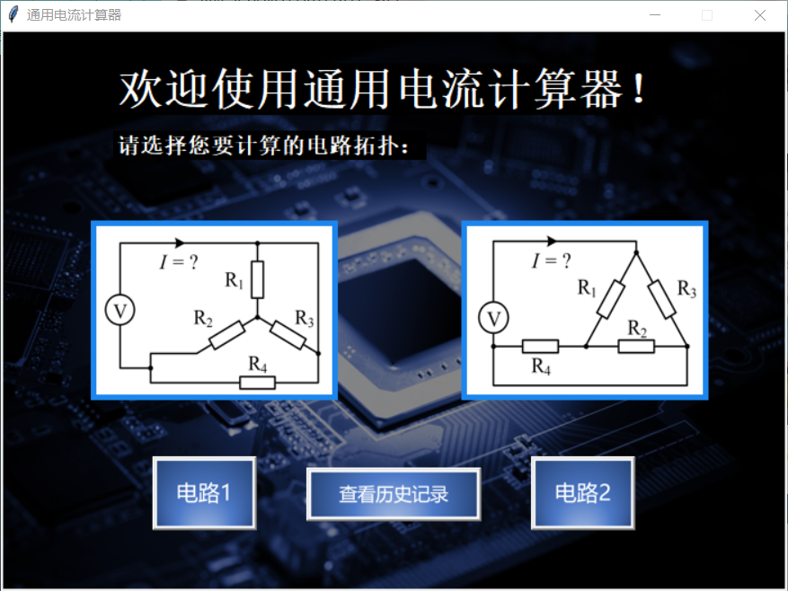
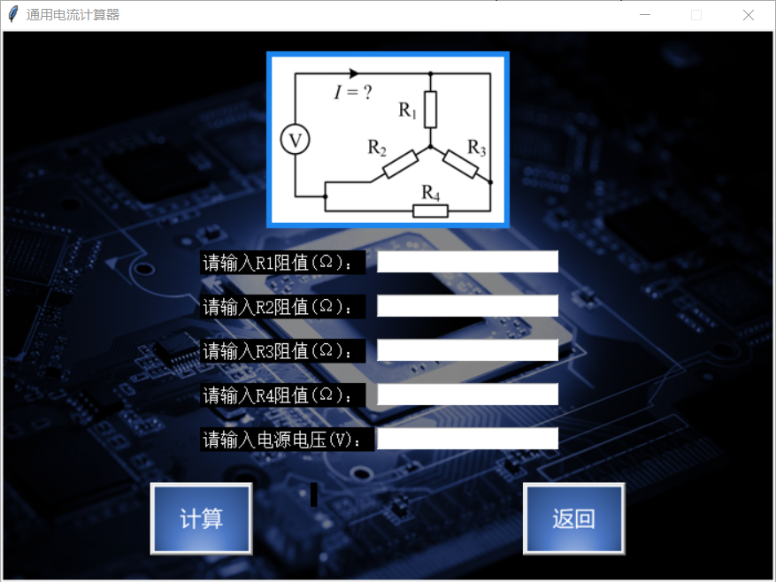
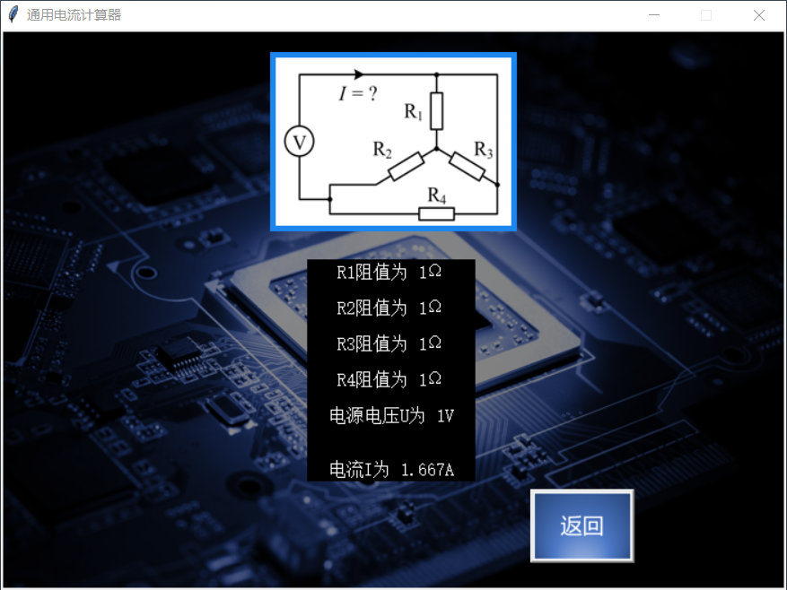
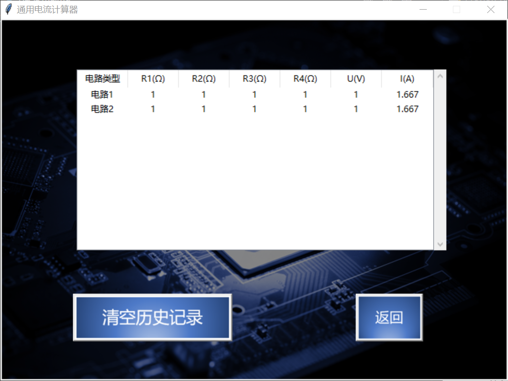

# 通用电流计算器

## 项目介绍

通用电流计算器是一款基于Python语言编写的，运用Y-△电路转化公式，在已知电路模型中，根据给定参数快速计算电路中电流的应用。它利用Tkinter模块进行窗口视窗设计，并通过使用openpyxl模块来保存计算的历史记录，实现数据持久化。

## 功能

- 辅助用户计算两种拓扑结构中的电流；
- 提示用户输入电压V及4个电阻的阻值；
- 输出用户输入的电压、阻值及最终的电流计算结果，所有数值量保留3位小数；
- 有良好的人机交互界面；
- 附加功能：可以查看、保存和删除历史记录，实现数据持久化。

## 安装流程

1. 解压文件“通用电流计算器.zip”；
2. 点击文件夹中“通用电流计算器.exe”即可开始使用；
3. 如需获取压缩包文件请通过文末的联系方式联系作者。

## 使用方法

1. 点击主界面电路模型图片下方按钮“电路1”或“电路2”选择相应的电路模型；

2. 根据提示文字输入对应的电路参数，点击“计算”即可得到运算结果；点击“返回”按钮可回到主界面；

3. 在主界面中点击“查看历史记录”按钮可查看历史运行记录，包括电路拓扑、电路参数与计算结果。点击“清空历史记录”可以清空所有记录。

## 版本迭代过程

- 通用电流计算器1.0：能够实现计算两种拓扑结构中的电流的功能，但是无法查看历史记录；
- 通用电流计算器2.0：调用openpyxl模块，将每次计算的操作存入‘record.xlsx’文件中，操作的历史记录得以保存，从而实现数据持久化。

## 项目作者
姓名 | 学校 | 专业 | 班级 | 电话 | 邮箱
:---:|:---:|:---:|:---:|:---:|:---:
沈毅|华中科技大学|电气工程及其自动化|1908|18362206036|u201912052@hust.edu.cn
李彦|华中科技大学|电气工程及其自动化|1908|13069476708|u201912066@hust.edu.cn
韩正|华中科技大学|电气工程及其自动化|1908|15110822722|u201912046@hust.edu.cn
高子涵|华中科技大学|电气工程及其自动化|1908|15072250823|u201912057@hust.edu.cn
黄冠达|华中科技大学|电气工程及其自动化|1908|17307886027|u201912067@hust.edu.cn

## 协议
版权所有(c)HUST-SEEE。保留所有权利。

根据**华中科技大学许可证**许可。